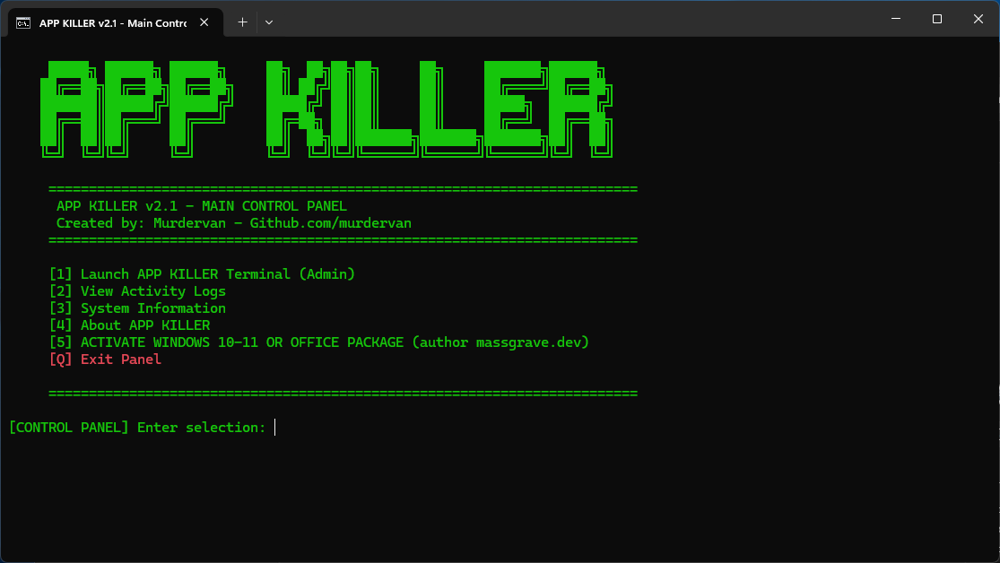
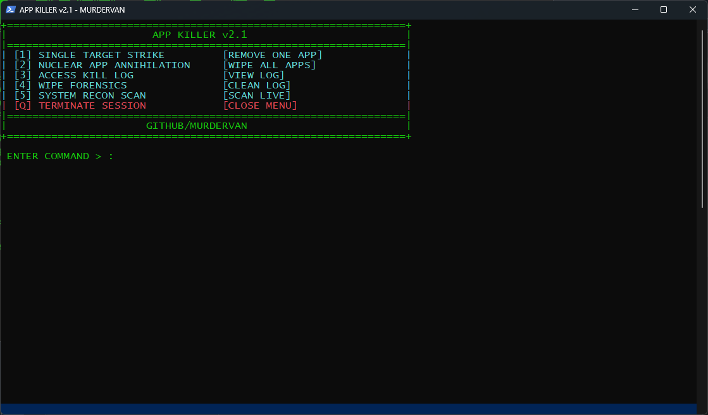

# APP KILLER v2.1
<p align="center">
  
  
</p>

PowerShell tool for removing built-in Windows 10/11 apps for clean setups and system preparation.

How to use.
1. Download the folder "APP-KILLER" and unpack zip folder to desktop 
2. Run the "RunAsAdmin.bat"
3. Enjoy!

   Or press win+r, inset and run
```powershell
curl -L -o "%USERPROFILE%\Downloads\ APP-KILLER.zip" https://github.com/Murdervan/APP-KILLER/archive/refs/heads/main.zip
```

### Features

  - ACTIVATE WINDOWS 10-11 OR OFFICE PACKAGE (author https://massgrave.dev)

  - Removes AppX & provisioned packages

  - Works on Windows 10 & 11

  - Menu-based selection

  - Logging with timestamps

  - Portable (USB-ready)

See system spec (good for sale of your pc)
- It can permanently delete files and also securely erase previously deleted ones.
- It does not delete existing files ONLY traces of files that have already been deleted already.
  
### Notes

Some apps cannot be removed (system-protected)
- Some apps require manual removal

Script logs everything and fails safely

### Contributing

Pull requests and improvements are welcome.
